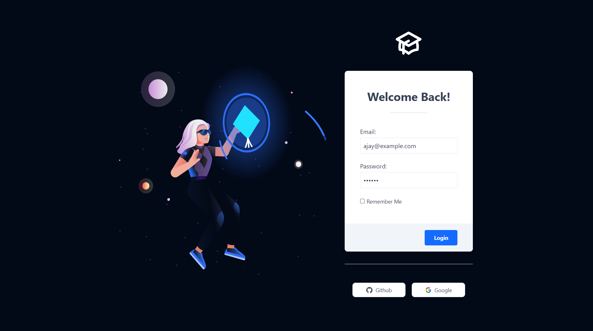
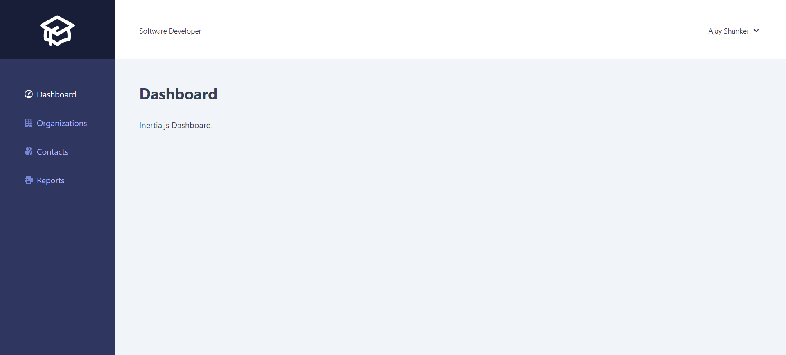

# Laravel and Inertia.js Dashboard

A demo application to illustrate how Inertia.js works.

## Login Page


## Dashboard


## Installation

Clone the repo locally:


Install PHP dependencies:

```sh
composer install
```

Install NPM dependencies:

```sh
npm ci
```

Build assets:

```sh
npm run dev
```

Setup configuration:

```sh
cp .env.example .env
```

Generate application key:

```sh
php artisan key:generate
```

Create an MySql database, simply update your configuration accordingly.


Run database migrations:

```sh
php artisan migrate
```

Run database seeder:

```sh
php artisan db:seed
```

Run the dev server (the output will give the address):

```sh
php artisan serve
```

You're ready to go! Visit In Dashboard in your browser, and login with:

- **Username:** ajay@example.com
- **Password:** secret

## Running tests


```
phpunit
```
